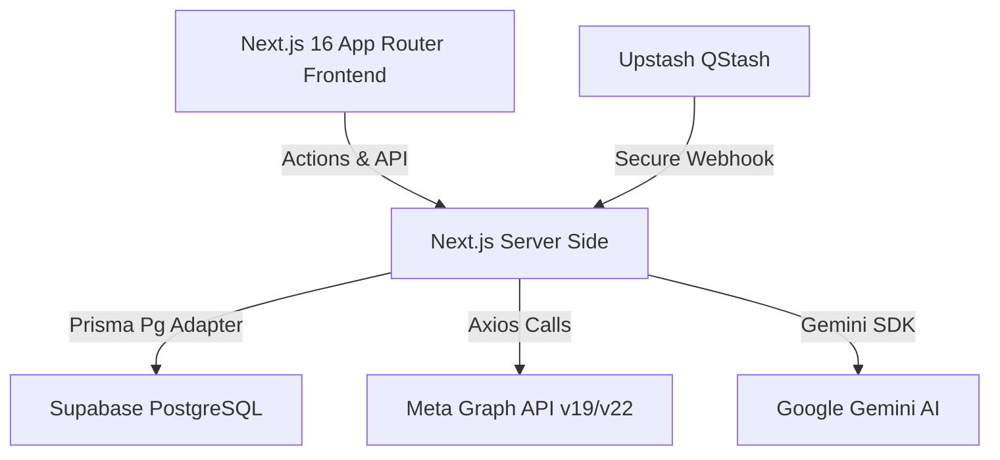
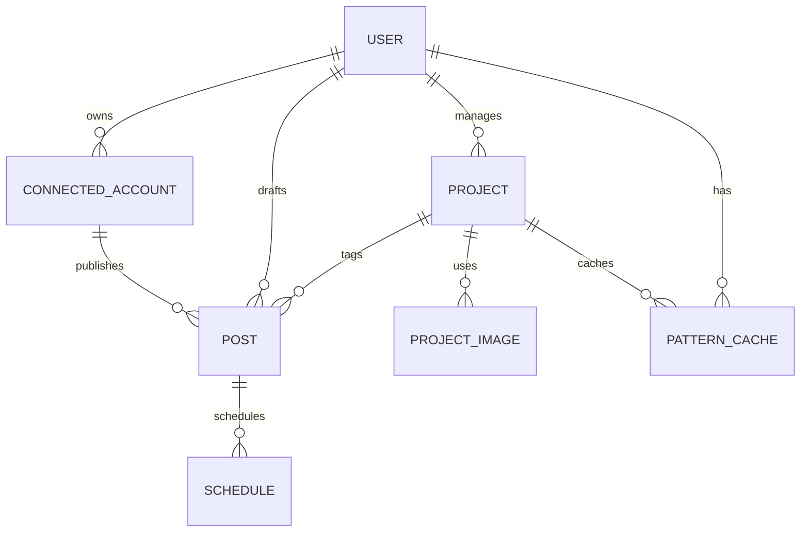
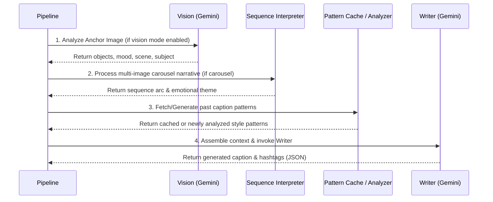
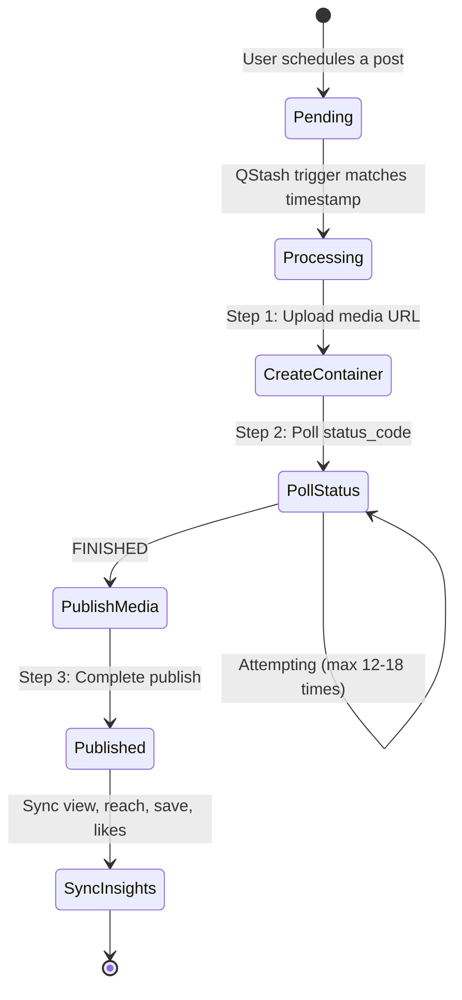

# Developer Documentation: Insta Auto (SNS-Instagram)

Welcome to the **Insta Auto** developer documentation. This guide is designed to help engineers understand the codebase architecture, database schema, AI generation pipelines, scheduling worker mechanism, and test suites.

---

## Table of Contents
1. [System Architecture Overview](#1-system-architecture-overview)
2. [Database Schema & Prisma Data Models](#2-database-schema--prisma-data-models)
3. [AI Caption Generation Pipeline (`lib/ai/`)](#3-ai-caption-generation-pipeline-libai)
4. [Meta (Facebook & Instagram) API Integration](#4-meta-facebook--instagram-api-integration)
5. [The Scheduled Publishing Engine (Cron Job)](#5-the-scheduled-publishing-engine-cron-job)
6. [Testing Architecture & Jest Configuration](#6-testing-architecture--jest-configuration)
7. [Environment Configuration & Variables](#7-environment-configuration--variables)
8. [Local Development Guidelines](#8-local-development-guidelines)

---

## 1. System Architecture Overview

**Insta Auto** is a multi-user platform for Instagram automation and AI-driven content generation tailored for the Japanese market.



### Core Technologies
*   **Framework**: [Next.js 16 (App Router)](https://nextjs.org/) for both the React-based frontend and server-side API routes/Server Actions.
*   **Authentication**: [NextAuth.js v5 (Beta)](https://authjs.dev/) for robust, session-based authentication.
*   **Database**: [Supabase (PostgreSQL)](https://supabase.com/) managed via [Prisma ORM](https://www.prisma.io/) using the `@prisma/adapter-pg` driver.
*   **AI Engine**: [Google Gemini Pro](https://deepmind.google/technologies/gemini/) via the official `@google/generative-ai` SDK.
*   **Worker/Cron Manager**: [Upstash QStash](https://upstash.com/docs/qstash) for reliable serverless cron scheduling and webhook triggers.

---

## 2. Database Schema & Prisma Data Models

The database models are defined in [schema.prisma](file:///c:/Users/kjlup/projects/websites/insta-auto/insta-auto/sns-instagram/prisma/schema.prisma) and outputted to a custom client path `@/lib/prisma-client`.



### Model Reference

1.  **`User`**: System account representing individual users on the platform. Stores general details, plus `aiUsageOption` (representing user strategy settings like "Normal AI Use", "Slight AI Use", etc.).
2.  **`ConnectedAccount`**: The link between a local User and a Meta Instagram Business Page.
    *   `pageAccessToken` & `longLivedUserToken` are stored to allow the platform to interact with the Facebook Page and Instagram Account on behalf of the user.
    *   `instagramBusinessId` is the key target ID for all publishing and insights operations.
3.  **`Project`**: Groups branding rules, target audience data, and instructions for content creation. Used extensively to prime the Gemini writer:
    *   `objective` (branding, sales, community)
    *   `toneStyle` (casual, professional, witty, bold)
    *   `preferredCtaTypes` (DM, bio link, comment)
    *   `wordsToAvoid` & `toneRestrictions` for content moderation and compliance.
4.  **`Post`**: Represents a single media item (image or video/Reel) created or staged on the platform. Stores raw asset URLs, the generated caption, hashtags, and performance insights (`reach`, `views`, `likes`, `saves`).
5.  **`Schedule`**: Controls when a particular post goes live.
    *   Statuses: `PENDING`, `PROCESSING`, `PUBLISHED`, `FAILED`.
6.  **`PatternCache`**: Performance optimizations for the AI pipeline. Stores JSON-serialized caption style analysis (`PatternAnalysis`) per Project and User to avoid calling the pattern analyzer API on every caption generation request. (TTL = 24 hours).

---

## 3. AI Caption Generation Pipeline (`lib/ai/`)

All AI operations are designed to execute efficiently inside a simplified pipeline located in [lib/ai/pipeline/generateCaptions.ts](file:///c:/Users/kjlup/projects/websites/insta-auto/insta-auto/sns-instagram/lib/ai/pipeline/generateCaptions.ts). 

Rather than chaining many independent, slow LLM requests, it follows a 5-step model that combines strategizing and copywriting:

### The 5 Pipeline Stages



1.  **Vision Analysis (`vision/analyzeImage.ts`)**: If vision-based AI is enabled (i.e. not in "Normal AI Use" or "Slight AI" modes), the platform analyzes the first ("anchor") image in the media array using Gemini's multimodal capabilities, extracting the subject, objects, scene description, and emotional mood.
2.  **Post Type Detection (`sequence/interpretSequence.ts`)**: Purely client-side logic detects if it is a single post or a carousel (multi-image).
3.  **Sequence Interpretation (`sequence/interpretSequence.ts`)**: For carousels, a lightweight request provides a thematic outline and emotional flow across the list of images.
4.  **Pattern Analysis (`pattern/analyzer.ts`)**: Scans up to 20 past successful posts for this project/user to identify consistent hooks, CTAs, length, and emoji distribution. Results are cached in the DB (`PatternCache`) for **24 hours**.
5.  **Run Writer (`writer/writer.ts`)**: A single unified prompt combining the anchor vision, carousel story, past caption patterns, user prompt instructions, and project restrictions into a comprehensive system prompt.

### AI Usage Options & Core System Prompts
The pipeline adapts dynamically to the user's `aiUsageOption` setting:
*   **`Slight AI` / `Slight AI Use`**: Suppresses image analysis. The model acts as a low-creativity assistant, focusing heavily on matching the exact historical voice patterns and user instructions without adding creative license.
*   **`Normal AI Use`**: Suppresses image analysis. Focuses on drafting readable, natural text based solely on project constraints and past patterns.
*   **Default (High AI / Vision)**: Runs the full multimodal pipeline. Analyzes the anchor image's visual context to tell a story rather than just describing the image.

---

## 4. Meta (Facebook & Instagram) API Integration

All interactions with Meta are centralized in [facebook.service.ts](file:///c:/Users/kjlup/projects/websites/insta-auto/insta-auto/sns-instagram/lib/services/facebook.service.ts). 

The platform relies on the **Instagram Graph API** (versioned at `v19.0` via `IG_GRAPH_BASE` in [constants.ts](file:///c:/Users/kjlup/projects/websites/insta-auto/insta-auto/sns-instagram/lib/constants.ts)).

### Key Operations
*   **OAuth Flow**: Users log in via Facebook, giving permissions for:
    *   `pages_show_list`
    *   `instagram_basic`
    *   `instagram_content_publish`
    *   `pages_read_engagement`
*   **Token Management**: 
    1. Exchange temporary auth code for a short-lived user token.
    2. Immediately exchange it for a **long-lived user token** (~60 days) via `exchangeForLongLivedToken`.
*   **Insights Syncing**:
    *   **Post-level**: Fetches views, reach, saves, and likes for individual posts via `getMediaInsights`. Uses Meta v22.0's unified `views` metric (which replaces the deprecated `plays` and `impressions` metrics).
    *   **Account-level**: Fetches 30-day analytics trends using daily `reach` (time-series) and total `profile_views` metrics.

---

## 5. The Scheduled Publishing Engine (Cron Job)

The engine that runs the platform's automated scheduling is an API route triggered by Upstash QStash at [app/api/cron/route.ts](file:///c:/Users/kjlup/projects/websites/insta-auto/insta-auto/sns-instagram/app/api/cron/route.ts).

### How the Schedule Cycle Works



1.  **Trigger**: Upstash QStash hits `/api/cron` securely in production by verifying the webhook signature via `verifySignatureAppRouter`.
2.  **Acquire Lock**: The job selects up to 3 `PENDING` schedules whose `scheduledFor` time is past the current time, updating their statuses to `PROCESSING` immediately (atomic transaction lock via Prisma).
3.  **Media Upload (Step 1)**: Calls the Instagram Graph API to create a media container. If it's a video, it uses `media_type: 'REELS'`.
4.  **Poll Status (Step 2)**: Instagram processes videos and images asynchronously. The worker polls `/IG_CONTAINER_ID?fields=status_code` every 5 seconds (up to 12 times for images, 18 times for videos/Reels) until the status is `FINISHED`.
5.  **Publish (Step 3)**: Dispatches a final request to `/media_publish` to make the post public.
6.  **Insights Syncing**: The worker also randomly picks up to 5 recently published posts to sync fresh performance metrics (`views`, `reach`, `saves`, `likes`) using `facebookService.getMediaInsights`.

---

## 6. Testing Architecture & Jest Configuration

The project features comprehensive unit, integration, and E2E testing systems.

### Setup Files
*   [jest.config.js](file:///c:/Users/kjlup/projects/websites/insta-auto/insta-auto/sns-instagram/jest.config.js): Defines the test projects configuration (unit, integration, and e2e scopes).
*   [jest.setup.ts](file:///c:/Users/kjlup/projects/websites/insta-auto/insta-auto/sns-instagram/jest.setup.ts): Configures DOM and browser mocks (e.g. `ResizeObserver`, custom fetch mocks) using `@testing-library/jest-dom`.
*   [babel.config.test.js](file:///c:/Users/kjlup/projects/websites/insta-auto/insta-auto/sns-instagram/babel.config.test.js): Transpiles TypeScript files during testing.

### The Role of Mocks (`__mocks__/`)
Because Node.js cannot parse non-JavaScript formats natively, Jest redirects stylesheet and asset imports to these files during runs:
*   `__mocks__/styleMock.js`: Intercepts stylesheet imports (`.css`, `.scss`) to prevent compilation errors.
*   `__mocks__/fileMock.js`: Intercepts media files (`.png`, `.jpg`, `.svg`, etc.) and returns dummy path strings.

### Test Command Suite
Run test suites using NPM scripts:
```bash
# Run all tests
npm run test

# Run unit tests only (isolated functions/components)
npm run test:unit

# Run integration tests (API endpoints and handlers)
npm run test:integration

# Run e2e tests (full user page flows)
npm run test:e2e

# Generate test coverage reports
npm run test:coverage
```

---

## 7. Environment Configuration & Variables

To run the application locally or in production, configure these environment variables in your `.env` or `.env.local` files:

| Variable | Description | Required For |
| :--- | :--- | :--- |
| `DATABASE_URL` | Direct connection URL to PostgreSQL (pooled). | Prisma operations |
| `DIRECT_URL` | Non-pooled direct database connection URL (port 5432). | Prisma migrations / schema pushes |
| `FACEBOOK_APP_ID` | App ID from Meta Developer Portal. | OAuth & Facebook Graph API |
| `FACEBOOK_APP_SECRET`| App Secret from Meta Developer Portal. | OAuth & Facebook Graph API |
| `NEXT_PUBLIC_SUPABASE_URL` | Public project URL for Supabase instance. | Client authentication / asset management |
| `NEXT_PUBLIC_SUPABASE_ANON_KEY` | Public anon key for Supabase instance. | Client authentication / asset management |
| `SUPABASE_SERVICE_ROLE_KEY` | Secret database bypass key for backend. | Admin actions |
| `AUTH_SECRET` | 32-character base64 string for encrypting NextAuth sessions. | Authentication security |
| `GEMINI_API_KEY` | Google Generative AI API Key. | Caption generation pipeline |
| `QSTASH_CURRENT_SIGNING_KEY` | Webhook verification signing key. | Cron worker security |

---

## 8. Local Development Guidelines

Follow these guidelines to maintain consistency and stability while coding:

### database Schema Management
Always update your types and database client whenever you edit [schema.prisma](file:///c:/Users/kjlup/projects/websites/insta-auto/insta-auto/sns-instagram/prisma/schema.prisma):
```bash
# Apply migrations to your DB
npx prisma db push

# Generate the custom-path client
npx prisma generate
```

### Aesthetic Standards
Our UI adopts a premium, high-fidelity dark-and-light theme.
*   Avoid standard hardcoded Tailwind background/border utilities (e.g. `border-gray-100`).
*   Utilize custom semantic design tokens configured in Tailwind v4 such as `bg-card`, `bg-surface`, and `border-card-border`.

### Code Hygiene
*   **No dead files**: Avoid keeping `.bak`, `.old`, or temporary scripts in your working directories.
*   **Secure API endpoints**: Ensure any webhook or cron path verifies calling signatures in production.
